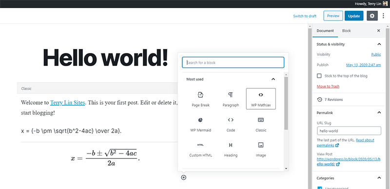
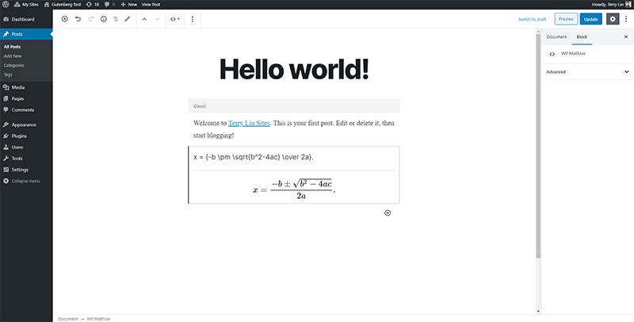

# WP Mathjax

WP Mathjax displays mathematical notation in web browsers, using MathML, LaTeX and ASCIIMathML markup on WordPress by using MathJax.js.

## Download

| source | download | 
| --- | --- | 
| WordPress | https://wordpress.org/plugins/wp-mathjax-plus |
| GitHub repository | https://github.com/terrylinooo/wp-mathjax/releases | 
| PHP Composer | `composer create-project terrylinooo/wp-mathjax wp-mathjax` |

## Installation

1. Upload the plugin files to the `/wp-content/plugins/wp-mathjax` directory, or install the plugin through the WordPress plugins screen directly.
2. Activate the plugin through the 'Plugins' screen in WordPress.
3. Go to the WP mathjax menu in Settings and set your options.

## How to use

WP Mathjax is smart enough that loads mathjax.js only when your posts contain mathjax syntax, by detecting the use of shortcode and block. So it will not be loaded on your website everywhere.

### Shortcode

In classic editor, you can use shortcode to render your mathjax syntax. If you are using WordPress version below 5.0, this is the only way you can use.


```
[mathjax]
x = {-b \pm \sqrt{b^2-4ac} \over 2a}.
[/mathjax]
```

### Gutenberg Block

Choose a mathjax block:



Fill in your mathjax syntax in the editor.



### License

WP Mathjax is developed by [Terry Lin](https://terryl.in) and released under the terms of the GNU General Public License v3.

### Also See

If you are looking for a [Markdown editor](https://wordpress.org/plugins/wp-githuber-md/) supporting mathjax, you can also check out my another WordPress plugin called the [WP Githuber MD](https://github.com/terrylinooo/githuber-md), which provides a variety of features not just mathjax, it is worth to try.
